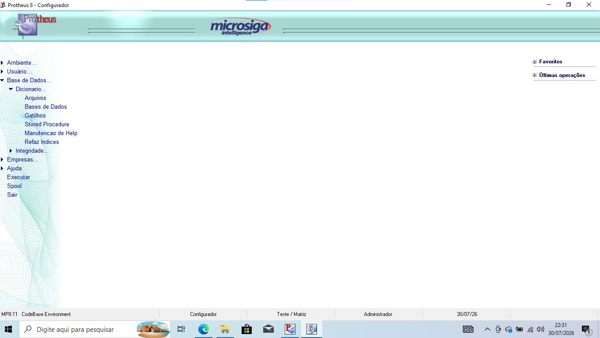
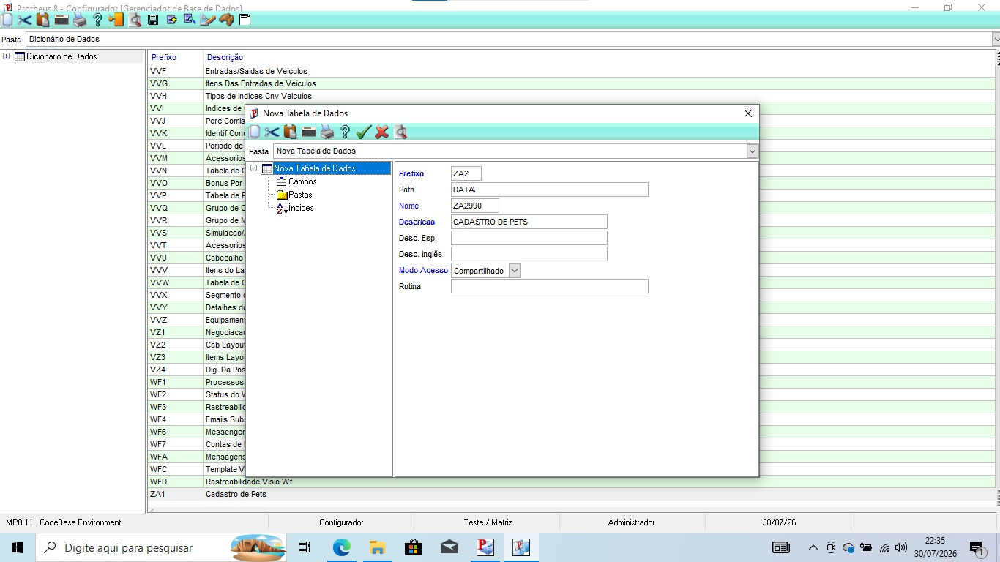
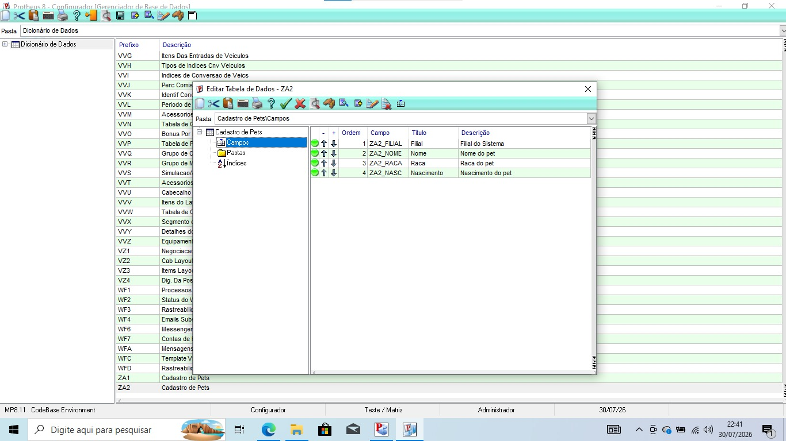
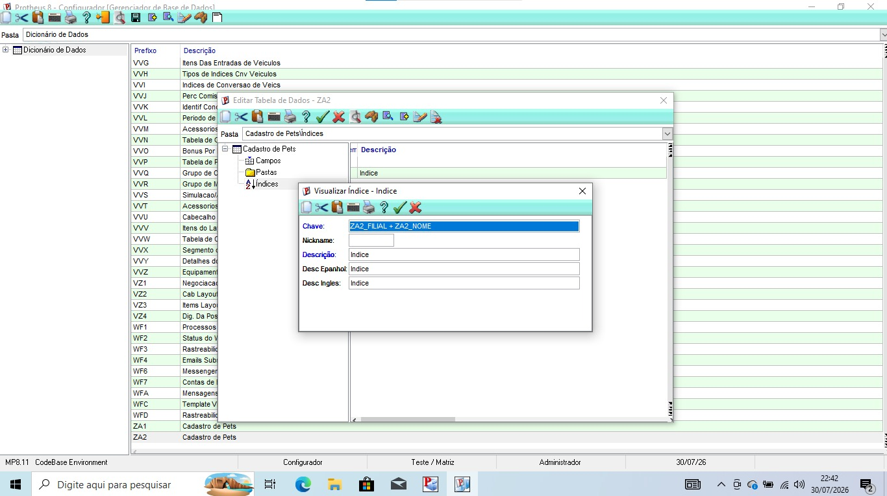
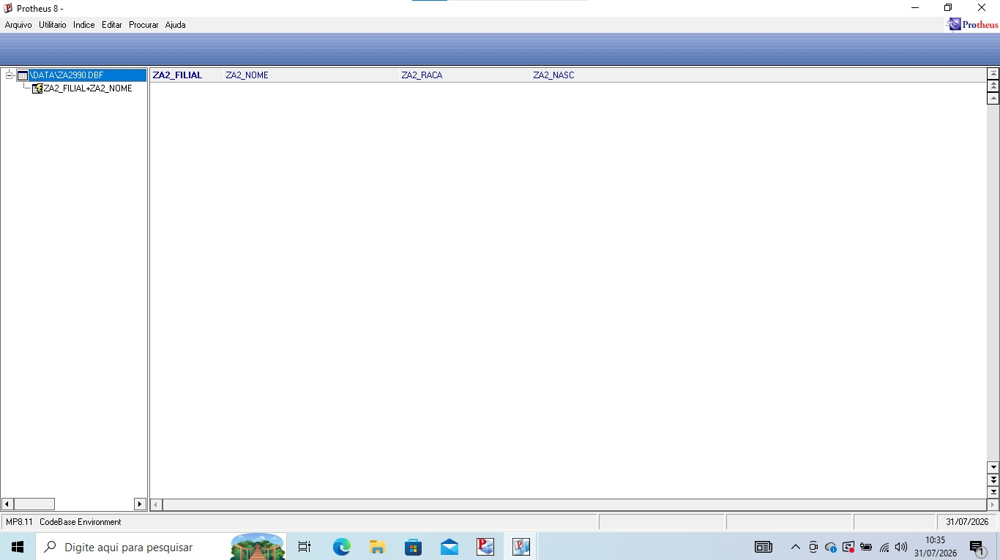

# Exercício 3 — Recriando a ZA1 no Configurador

1. Acessar o sistema pelo SmartClient.

2. Entrar no configurador SIGACFG.
3. Entrar na área de dicionário de dados.
4. Criar a tabela customizada ZA1.

5. Confirmar o registro da tabela no SX2.
6. Acessar a manutenção de Campos.
7. Cadastrar no SX3 os seguintes campos:

- **ZA1_FILIAL**
- **ZA1_NOME**
- **ZA1_RACA**
- **ZA1_NASC**

8. Definir os títulos, tipos e tamanhos dos campos.
9. Cadastrar um índice com a expressão:

**ZA1_FILIAL + ZA1_NOME**

10. Salvar as alterações.
11. Executar a atualização da tabela.
12. Abrir o MPSDU e conferir os campos.

