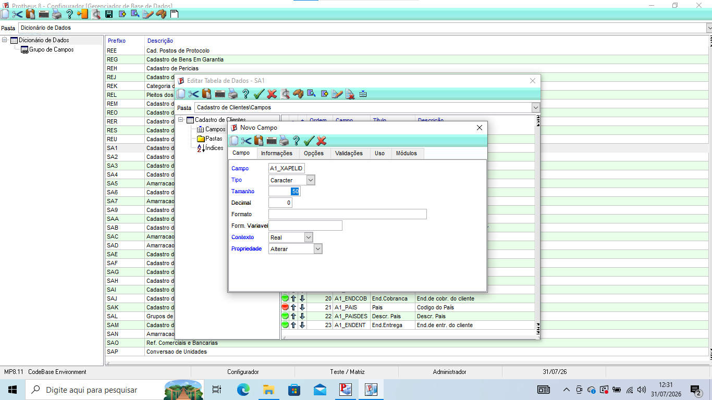
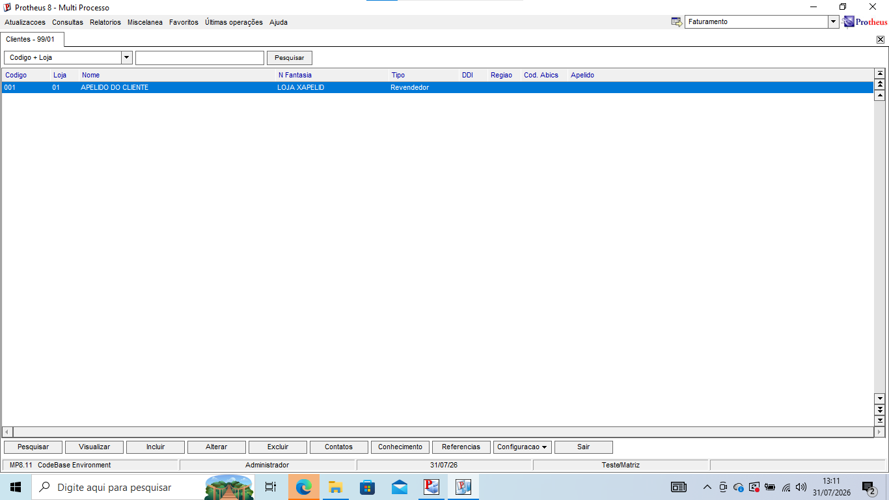

# Exercício 4 — Campo customizado na SA1

1. Abra o SmartClient.
2. Selecione SA1.
3. Adicione as características do campo no configurador.

4. Atualize no dicionário de dados.
5. Retorne ao SmartClient e mostre o campo.

